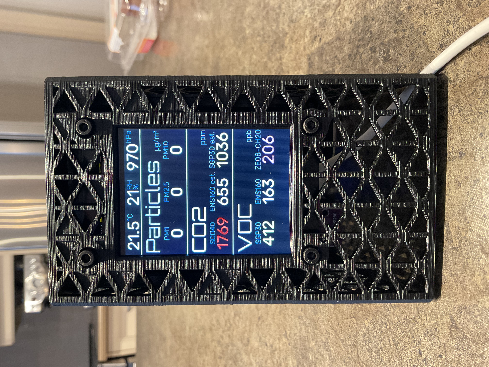
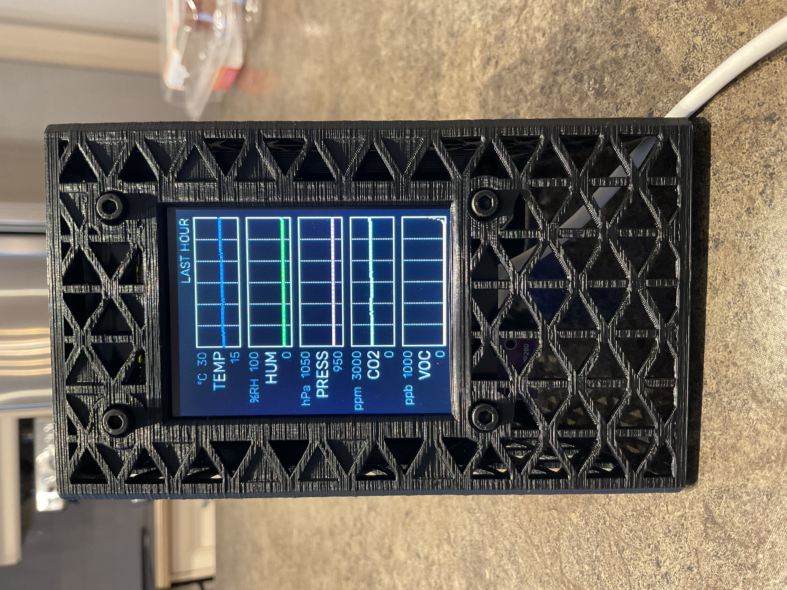
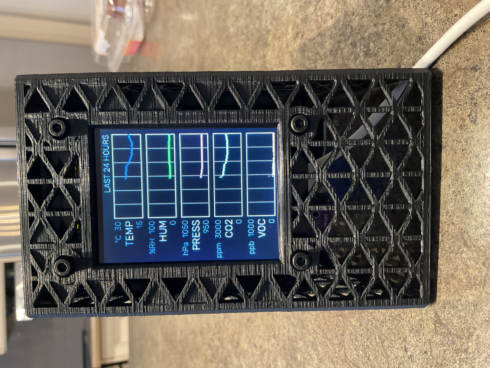

# My Sensor Box V2 Software Updates

Some updates to the SensorBox DIY project configuration files.

See [here](https://www.printables.com/model/1079858-3d-printer-emission-sensor-array-sensorbox-v2) for more info.

## (2025-02-24)

- Another step in cleaning up the code: Using packages to separate the various chunks of code see them in the `packages` folder. This is done to simplify the coordination of changes between the sensor-box versions, and help separate the logics.
- The main yaml files have been renamed to remove space characters in them. 

## (2025-02-23)

- Correction related to last ESPHome update, added `psram:` definition
- First line adj for the temperature minus sign required place
- MQTT support functional. You must adjust sensors' `update_interval:` as desired

## (2025-02-21)

- A short click selects next page to show, and also returns the screen to its maximum light.
- Added the minus character to the fl30 font, required when the temperature is below zero.

## (2025-02-19)

### New code versions

There are now three versions of the software available here:

- The Standalone Version (`sensor-box standalone.yaml`)
- The Home Assistant Version (`sensor-box ha.yaml`)
- The MQTT Version (`sensor-box mqtt.yaml`)

Please note that the MQTT Version is not ready yet. 

## (2025-02-17)

### Code cleanup

The lambda functions have been reformatted to be in line with C / C++ usage

### Button clicks management and Pages selection

A new click has been added to permit page selection. There are now 3 click durations:

- Short click: Between 10 and 350ms: page selection
- Medium click: Between 750ms and 3 seconds: Screen dimming selection
- Long click: Between 5 seconds and 15 seconds: Wifi AP Mode

There are 3 pages available to access in sequence through a short click:

- The Sensors page (as per the original software)
- Graphics for the last hour (temperature, humidity, pressure, CO2, VOC)
- Graphics for the last 24 hours

### Added Pressure of bmp280

The bmp280 pressure sensor has been added on the top line of the first page.

### Graphics support

To permit proper access to the temperature and humidity sensors by the graph add-on, two template sensors have been added. The lambda producing those sensors' state are now responsible for selecting the first sensor that returns a valid value. The first page is now using those sensors to display the current temperature and level of relative humidity.

### secrets.yaml

Added `secrets.yaml` support. Please use the `secrets.yaml.example`, copy it to secrets.yaml and update it with your values.

### Pictures

Here are some pictures showing the current 3 pages displayed by the SensorBox:

 
&nbsp;&nbsp;
 
