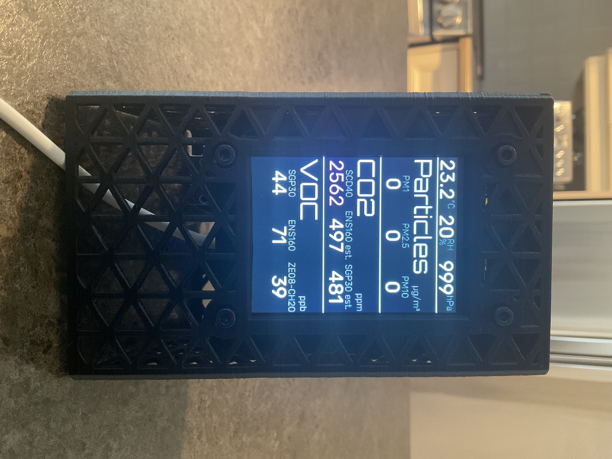
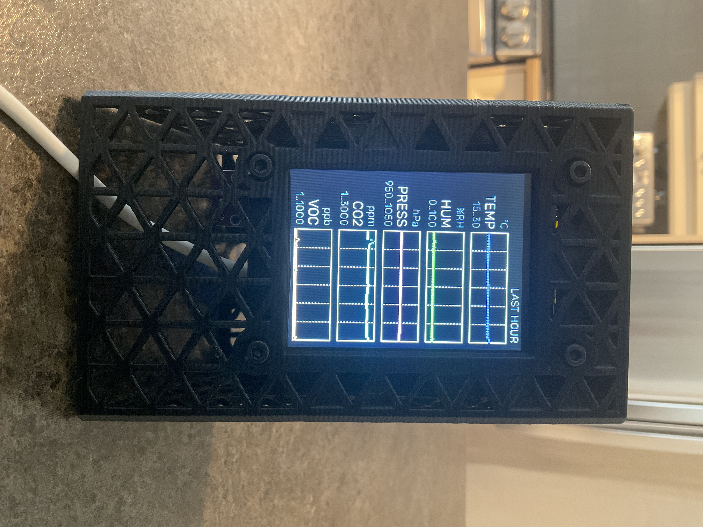
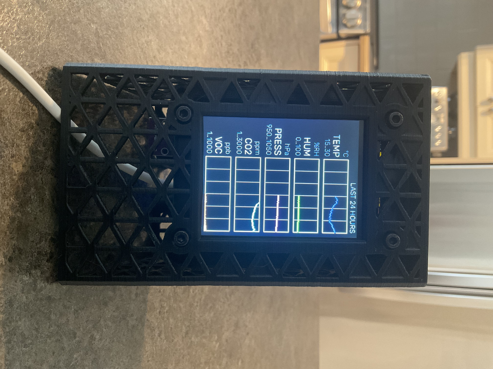

# My Sensor Box V2 Software Updates

Some updates to the SensorBox DIY project configuration file.

See [here](https://www.printables.com/model/1079858-3d-printer-emission-sensor-array-sensorbox-v2) for more info.

(2025-02-15)

- Code cleanup
- Double-Click page selection. There is now 3 pages available to access in sequence through a double click:
  - The Sensors page (as per the original software)
  - Graphics for the last hour (temperature, humidity, pressure, CO2, VOC)
  - Graphics for the last 24 hours
- Added Pressure from bmp280 on first page, first line
- Added two template sensors (temperature, humidity)
  - Selection code for the sensor to use is now in those sensors.
- Added `secrets.yaml` support. Please use the `secrets.yaml.example`, copy it to secrets.yaml and update it with your values.

  
&nbsp;&nbsp;
  

ToDo:
- [x] Add button double-click 
- [x] Add a graphics page
- [ ] MQTT support
- [x] Add secrets.yaml support